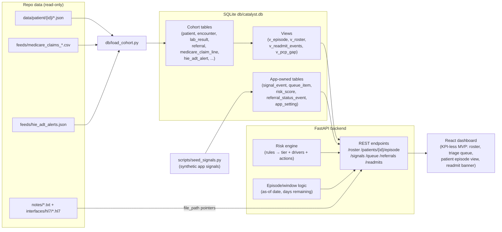

# Hospital Dashboard MVP — Architecture & Build Plan

Implements **D1–D10** from [core-functionality.md](./core-functionality.md) (Hospital dashboard, Must-have). Patient app (A1–A14) and D11+ are explicitly out of scope.

---

## 1. Executive summary

The MVP is a single-hospital "SHFFT episode command center" for Memorial General's ortho navigator and case-management staff, covering the 50-patient synthetic cohort. The recommended stack is a **FastAPI (Python) backend over the existing SQLite database (`db/catalyst.db`) with a React + Vite + TypeScript frontend**, reusing the visual language of the existing HTML mockup. Almost all of D1, D4, D8, D9, and D10 can be served directly from tables already loaded by `db/load_cohort.py`; the main new work is a small **derived layer** (episode window, rule-based risk engine, PCP-gap flag) and a small **application-owned write layer** (signal events, triage queue items, referral status updates). Because there is no patient app yet, D6/D7 signals will be **seeded synthetically per patient archetype** by a script, so the timeline and triage queue are demoable end-to-end. Readmission visibility (D10) unifies three sources with different latencies: local encounters (anchor readmits and ED-only returns), near-real-time HIE ADT alerts (`hie_adt_alert`), and the lagged Medicare claims feed (`medicare_claim_line`, outside CCN `140010`) — including the claims-only case (patient 29). A fixed, configurable **"as-of" demo date** drives days-remaining, active/completed status, and which feeds have "arrived." The build is sequenced into six demoable milestones, from a read-only roster to a fully interactive triage workflow.

---

## 2. Target architecture

### Recommended stack

| Layer | Choice | Rationale |
|---|---|---|
| Frontend | **React 18 + Vite + TypeScript** | Componentized roster/queue/detail panels; fast dev loop; mockup CSS ports over nearly as-is |
| Backend | **FastAPI (Python 3.11+)** | Same language as `load_cohort.py`; automatic OpenAPI docs; trivial SQLite access via `sqlite3`/SQLAlchemy Core |
| Database | **SQLite (`db/catalyst.db`)** | Already built and loaded; add a handful of app-owned tables + views in a migration script |
| Derived logic | **Python risk/signal modules + SQL views** | Rule-based risk engine and episode-window math live in the API layer; no separate service |
| Notes/HL7 | **Served as static text via API** | DB already stores `file_path` pointers in `clinical_document` / `hl7_message` |

No auth, no multi-tenancy, no message broker — this is a prototype demo against a synthetic cohort.

### Component diagram

### How each source reaches the UI

- **SQLite cohort tables** → SQL views + API → roster, episode view, PCP tracker. `load_cohort.py` is the only ingestion path for repo files; the app never parses patient JSON directly.
- **Notes / HL7 files** → `clinical_document.file_path` → API streams raw text → "source documents" section of the patient episode view.
- **HIE ADT alerts** (`hie_adt_alert` table, loaded from `feeds/hie_adt_alerts.json`) → near-real-time outside-admit flags on roster rows, timeline, and triage queue. Only present for some outside-readmit patients.
- **Medicare claims feed** (`medicare_claim_line`) → lagged outside readmits (CCN `140010`) and ED-only professional lines (`clm_type = 'P'`). Only surfaced when `file_received_dt` ≤ the as-of date, so the demo can show "claims arrive later" honestly.
- **Synthetic app signals** (`signal_event`, seeded by script) → signal timeline (D6) and triage queue (D7).

**As-of demo date:** all "days remaining," active/completed/**upcoming** status, and feed availability are computed relative to a single clock — see [as-of-date.md](./as-of-date.md). Default freeze: **`2026-06-28`**. Set env `CATALYST_AS_OF` or `app_setting.as_of_date`; leave empty to use live `today()`. Never scatter raw `date.today()` through business logic.

### Security seams

Do **not** build full SOC-2 / HIPAA for the synthetic MVP. Do land cheap hooks so compliance is additive later — full rules in [security-foundations.md](./security-foundations.md):

| Hook | MVP behavior |
|---|---|
| Auth boundary | Every FastAPI route uses `Depends(get_current_user)`; demo mode returns a fixed navigator user + `org_id` |
| Audit | Append-only `audit_event` for mutations (queue assign/resolve, PCP status, etc.) |
| Path sandbox | Note/HL7 reads resolve only under `data/patient/` |
| Tenancy column | `org_id` on app-owned tables (default Memorial `260001`) |
| Config / secrets | Env only; startup banner: synthetic data, not a PHI production deploy |

Real IdP, TLS-everywhere, encryption at rest, and BAAs are **deferred**.

---

## 3. Capability → design mapping

| # | Capability | UI surfaces | Data sources | Notes / edge cases |
|---|---|---|---|---|
| D1 | **Episode roster** | Roster table (main panel) | `v_anchor_encounters` (DRG 480–482), `patient`, `encounter_procedure`; derived: days remaining, status | Days remaining = discharge + 30 − as-of date, floor 0. Status: active if as-of ≤ discharge+30, else completed. Anchor FIN pattern `00####`. |
| D2 | **Risk tier on every row** | Tier badge on roster + queue + detail header | Risk engine over `patient` (age), `problem`, `lab_result`, `nursing_assessment`, `social_history`, `encounter` (LOS, disposition), `therapy_evaluation` | Computed on demand, cached in `risk_score`. Missing labs → rule silently skipped, never fails. |
| D3 | **Filter & sort** | Roster filter chips + sortable columns | Roster API params: risk tier, disposition, open-signal, PCP gap, days remaining | "Open signal" needs `signal_event`/`queue_item` (Milestones 4–5); ship risk/disposition/days filters first, add signal filter later. |
| D4 | **Patient episode view** | Detail panel (right/below roster) | `problem`, `lab_result` (albumin/Hgb/creatinine LOINCs, latest + trend), `encounter_procedure`, `encounter` (LOS), `therapy_evaluation` (weight-bearing), `inpatient_order` (DME), `medication` (discharge), `clinical_document` (note links) | Patients with readmits have multiple FINs — episode view is anchored on the anchor FIN, with other encounters shown under readmits (D10). |
| D5 | **Risk drivers + suggested actions** | "Why this tier" card in detail panel | Same inputs as D2; each fired rule maps to a driver label + suggested action string | Cap at top 3–5 drivers by weight. Actions are static text per rule (e.g. low albumin → "nutrition consult / respiratory watch"). |
| D6 | **Live signal timeline** | Timeline in detail panel; badges on roster | `signal_event` (app-owned, **synthetically seeded**: check-in done/missed, symptom flag by type/severity, med adherence, help request) | No patient app exists — seeder generates plausible streams per archetype (e.g. readmit patients get worsening symptoms before the readmit date). SNF/IRF patients get sparse or facility-proxy signals (D9). |
| D7 | **Triage / work queue** | Queue panel beside roster | `queue_item` (app-owned): derived from red/yellow `signal_event` + risk tier ordering; fields: assignee role, status, resolution note | Priority = severity rank × risk tier rank. Writes (assign, resolve+note) persist to SQLite. Resolving a queue item does not delete the underlying signal from the timeline. |
| D8 | **PCP referral tracker** | Status column/chip on roster; referral card in detail | `referral` (type LIKE '%Primary Care%', via `v_pcp_referrals`); `referral_status_event` for dashboard-made updates (no-show, declined, completed) | Source data only has ordered/scheduled-type statuses; the extra TEAM states (no-show, declined) are dashboard-entered overrides layered on top. "PCP gap" flag = no referral, or not scheduled, or appointment past with no completion. |
| D9 | **Disposition-aware context** | Disposition chip on roster; "care setting" card in detail (who to contact, expected engagement) | `encounter.discharge_disposition(_code)`, `care_team_member`, `registration` emergency contact, `therapy_evaluation.recommendation` | Mostly presentation logic: static per-disposition contact playbook (home → patient/caregiver; SNF/IRF → facility nurse; HHA → agency) and engagement norms used to calibrate "missed check-in" severity. |
| D10 | **Readmission / bounce visibility** | Red banner on roster row + readmit card in detail + queue item | Local: second `encounter` rows (inpatient readmit; ED-only via `patient_class`/`ed_visit_datetime`). Outside: `hie_adt_alert` (near-real-time, some patients) and `medicare_claim_line` with `prvdr_ccn = '140010'` (lagged). ED-only in claims: `clm_type = 'P'` | Unify into one `v_readmit_events` view with `source` + `latency` labels. Patient 29 is claims-only (no HIE alert) — must still appear once claims `file_received_dt` ≤ as-of date. Dedupe HIE alert vs later claim for the same outside stay (match on facility CCN + date window). |

---

## 4. Data & domain model for the dashboard

### Derived entities beyond the raw schema

| Entity | Form | Contents |
|---|---|---|
| **Episode** (`v_episode`) | SQL view | Anchor encounter + window: `window_end = discharge + 30d`, `days_remaining`, `status` (active/completed), disposition, procedure summary. One row per anchor FIN. |
| **Roster row** (`v_roster` / API composition) | View + API join | Episode + risk tier + open-signal count + PCP-gap flag + readmit flag. The one payload the roster and its filters run on. |
| **Risk score** | `risk_score` table (cache) + Python rules | `patient_id, fin, tier, score, drivers_json (rule, weight, action), computed_at`. Recomputable at any time; stored so the roster query is cheap. |
| **Signal event** | `signal_event` table (app-owned) | `patient_id, fin, occurred_at, kind` (checkin_done, checkin_missed, symptom, med_taken, med_missed, help_request), `severity` (green/yellow/red), `detail_json`. Seeded synthetically. |
| **Queue item** | `queue_item` table (app-owned) | `signal_event_id, patient_id, priority, assigned_role, status (open/in_progress/resolved), resolution_note, resolved_at`. |
| **Referral status event** | `referral_status_event` table (app-owned) | Dashboard-entered PCP status overrides (`scheduled/completed/no_show/declined` + timestamp + note); effective status = latest event, falling back to `referral.status`. |
| **Readmit event** (`v_readmit_events`) | SQL view | Union of: local inpatient readmits, local ED-only returns, HIE ADT alerts, outside claims — normalized to `{source, event_date, facility, latency_label, drg/complaint}`. |
| **App setting** | `app_setting` table | `as_of_date`, seed parameters. |
| **Audit event** | `audit_event` table (app-owned, append-only) | Mutations: actor, action, entity, patient_id, org_id, detail_json. See [security-foundations.md](./security-foundations.md). |

### Computed vs stored

- **Computed at query time (cheap, from views):** days remaining, episode status, PCP-gap flag, readmit-event union, open-signal counts.
- **Computed once and cached (tables):** risk score + drivers (recompute on demand via an admin endpoint), seeded signal stream.
- **Stored because they are user writes:** queue assignment/resolution, referral status overrides, **audit_event rows**. These are the only mutations in the MVP; everything else is read-only over the cohort.

App-owned tables live in the same `catalyst.db` via a small `db/app_tables.sql` migration, so `load_cohort.py` can be re-run without destroying triage work (loader only touches cohort tables).

### Rule-based risk approach (MVP)

Weighted point rules; tier by threshold (e.g. **High ≥ 6, Medium 3–5, Low ≤ 2**, tuned so the cohort splits roughly 20/50/30). Each rule carries a driver label and suggested action for D5.

| Rule (input) | Points | Suggested action |
|---|---|---|
| Age ≥ 80 (`patient.birth_date`) | 2 | Closer check-in cadence |
| Comorbidity burden: ≥2 of CHF/COPD/CKD/diabetes/afib on `problem` | 2 | Flag for case-management touch |
| Cognitive impairment: dementia on `problem` or CAM-positive `nursing_assessment` | 2 | Route outreach to caregiver; delirium watch |
| Albumin < 3.5 g/dL (latest `lab_result`) | 2 | Nutrition consult; respiratory watch |
| Hemoglobin < 10 g/dL | 1 | Anemia follow-up; fall caution |
| Creatinine ≥ 1.5 mg/dL or CKD | 1 | Med review (renal dosing) |
| Anticoagulant on discharge meds | 1 | Bleed-risk education; med adherence watch |
| Morse fall score high (`nursing_assessment`) | 1 | Fall prevention pathway |
| LOS > 6 days (`encounter`) | 1 | Deconditioning watch, PT follow-up |
| Lives alone (`social_history.living_situation`) and discharged home | 2 | Caregiver/HHA outreach; daily check-in |
| Discharged to SNF/IRF | 1 | Facility liaison handoff |
| Non-weight-bearing / touch-down WB (`therapy_evaluation`) | 1 | Mobility/fall pathway |

Missing inputs skip the rule. Top drivers = fired rules sorted by points, capped at 5. This is deliberately transparent and demo-explainable — no ML.

---

## 5. Build plan (ordered milestones)

Each milestone ends demoable in a browser.

**M1 — Foundation: data layer, API skeleton, read-only roster (D1, D9 partial) — M**
- Deliverables: `db/app_tables.sql` (app tables + `v_episode`, `v_roster`, `v_readmit_events`, `v_pcp_gap`, **`audit_event`**, **`org_id` on app tables**); FastAPI project with `/roster` endpoint and **`Depends(get_current_user)` demo stub** on all routes; **path sandbox helper** ready for note/HL7 reads; React shell with roster table (patient, admit/discharge, procedure, MS-DRG, disposition chip, days remaining, status); as-of date setting; startup log banner (synthetic / not PHI production).
- Acceptance: all 50 cohort anchor episodes render with correct days-remaining/status at the configured as-of date (D1); disposition visible on every row (D9 partial); `python3 db/load_cohort.py` + one migration + `uvicorn` + `vite dev` is the full setup; every API request resolves a demo user via the auth stub (even if unused in UI yet).

**M2 — Patient episode view + disposition context (D4, D9) — M**
- Deliverables: `/patients/{id}/episode` endpoint; detail panel with comorbidities, key labs (albumin/Hgb/creatinine with abnormal flags), procedure + LOS, weight-bearing/DME notes, discharge meds, care team, links to raw notes; per-disposition "who to contact" card.
- Acceptance: clicking any roster row shows a correct index-stay summary sourced from SQLite (D4); the contact card differs correctly for home vs HHA vs SNF vs IRF patients (D9).

**M3 — Risk engine: tier, drivers, filters (D2, D5, D3 partial) — M**
- Deliverables: rule engine module + `risk_score` cache + recompute endpoint; tier badge on roster and detail; "risk drivers + suggested actions" card; roster filter/sort by risk tier, disposition, days remaining.
- Acceptance: every roster row has a tier (D2); detail shows top ≤5 drivers each with a concrete action (D5); filtering by risk/disposition/days works (D3 partial); cohort tier distribution is plausible (not all one tier).

**M4 — Readmission visibility + PCP tracker (D10, D8) — M**
- Deliverables: `v_readmit_events` surfaced as roster badge + detail readmit card with source/latency labels (local readmit, ED-only return, HIE ADT alert, outside claim); claims gated on `file_received_dt` ≤ as-of date; HIE-vs-claim dedupe; PCP referral status chip + gap flag on roster; status-update UI writing `referral_status_event` **and `audit_event`**; PCP-gap filter (completes another D3 slice); note/HL7 open uses **path sandbox**.
- Acceptance: patient 1's pneumonia readmit, an ED-only bounce, an HIE-alerted outside admit, and **patient 29 (claims-only)** all display with correct source labels (D10); PCP statuses are editable through the full TEAM set and gap rows are filterable (D8, D3); each PCP status change leaves an audit row.

**M5 — Synthetic signals + timeline (D6) — M**
- Deliverables: `scripts/seed_signals.py` generating archetype-aware signal streams (deteriorating patients flag symptoms before their readmit date; SNF patients get sparse/proxy engagement; healthy-home patients mostly green check-ins); `/patients/{id}/signals` endpoint; timeline component (check-ins, symptom flags, med adherence, help requests, interleaved with readmit events); open-signal badge on roster + open-signal filter (finishes D3).
- Acceptance: timeline renders chronologically with severity coloring for every patient (D6); seeded stories are consistent with each patient's outcome; all five D3 filter dimensions now work.

**M6 — Triage / work queue + demo hardening (D7) — L**
- Deliverables: queue derivation (red/yellow signals + readmit events → `queue_item`, priority = severity × risk tier); queue panel with assign-to-role, resolve-with-note; **each assign/resolve writes `audit_event`**; persistence across restarts; end-to-end demo pass (seed determinism, empty states, one-command `make demo` or `README` runbook).
- Acceptance: queue is ordered by priority and reflects risk × severity (D7); assign and resolve-with-note persist in SQLite and survive re-running `load_cohort.py`; audit rows exist for those mutations; a scripted 5-minute demo exercises D1–D10 without errors.

Relative effort: M1–M5 ≈ M each, M6 ≈ L. Suggested order matches `core-functionality.md` §D build order (roster → risk → signals/queue → PCP), with readmits/PCP pulled before signals because they need no seeding.

---

## 6. Out of scope / deferred

- **D11–D14**: TEAM compliance strip, outreach audit trail, population KPIs, care-setting handoff status. (The mockup's KPI strip is illustrative — it is D13 and is *not* built in this MVP.)
- **D15–D18**: episode spend vs target, EHR/ADT auto-enrollment, SNF/partner portal, deep analytics.
- **Patient app (A1–A14)** — signals are seeded, not user-generated.
- **Full** auth/SSO, multi-hospital production tenancy, encryption at rest, BAAs, and HIPAA/SOC-2 attestation (synthetic data only). **Security seams** (auth stub, audit, path sandbox) *are* in MVP — see [security-foundations.md](./security-foundations.md).
- Real HL7/FHIR interface processing (HL7 files are only viewable as raw text).
- Claims reconciliation, spend math, and payment logic.
- Notifications (email/SMS/pager) out of the triage queue.

## 7. Open questions / decisions for the human

1. **As-of demo date** — **Decision: default freeze `2026-06-28`**, swappable to live today via `CATALYST_AS_OF` / `USE_REAL_TODAY` ([as-of-date.md](./as-of-date.md)). Note: only ~6 episodes are truly *active* on that date; patients 31–50 are `upcoming`. Revisit freeze (e.g. Aug 1) if you need a busier active roster.
2. **Risk thresholds/weights** — are the sketched rule weights acceptable for a demo, or should a clinician review before we show tiers to stakeholders?
3. **Signal seeding realism** — how strongly should seeded signals foreshadow known outcomes (readmits)? Fully deterministic and story-driven, or partly randomized per run?
4. **Write persistence** — app-owned tables in `catalyst.db` (single file, simplest) vs a separate `app.db` (survives full cohort reloads by construction). Plan assumes single-file with loader guardrails; confirm.
5. **ED-only detection** — confirm the heuristic (local: `patient_class = 'Emergency'` or `ed_visit_datetime` set; claims: `clm_type = 'P'` + place-of-service) against a few cohort patients during M4.
6. **Queue seeding on first run** — should historical red signals from before the as-of date arrive pre-resolved (cleaner queue) or open (busier, more realistic demo)?
