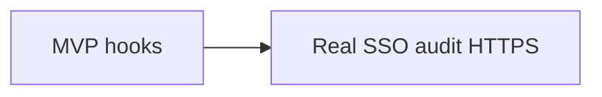

# Security foundations (cheap now, robust later)

How to build the hospital dashboard MVP ([hospital-dashboard-mvp-plan.md](./hospital-dashboard-mvp-plan.md)) so we can add real security / compliance later **without rewriting everything**.

This does **not** mean the prototype is HIPAA- or SOC 2–certified. Fake patient data ≠ a compliant product.

**Who this is for:** anyone implementing D1–D10 (including Fable).

---

## 1. Where we are today

| Fact | So what? |
|---|---|
| Patient data is **made up** (toy Memorial General cohort) | No real-patient legal obligations for *this* dataset |
| App runs locally (FastAPI + SQLite + React) | Good for demos; **not** ready for real medical data |
| No real hospital login yet | Use a fake “demo user” on every API call |
| Notes live as files under `data/` | Still only open files inside that folder (bad habit = future leak) |

**Simple rule:** Write code as if every patient field were real private health data — even though it’s fake. Logging, APIs, and audit trails stay clean when real data arrives.

We add **hooks** now; we turn on **full compliance** later.

---

## 2. What we’re trying not to mess up

Even in a prototype, avoid these:

| Risk | Plain English | What we do in the MVP |
|---|---|---|
| Anyone can hit the API | No idea who is looking at the roster | Every route asks “who is the user?” (demo user for now) |
| Note URLs escape the data folder | App could read random files on disk | Only allow paths under `data/patient/` |
| Staff actions with no history | Can’t prove who changed a PCP status or closed a triage item | Write an `audit_event` row on every change |
| API keys in git | Keys get leaked | Config in env vars; keep `.env` / scripts gitignored |
| Logs full of patient details | Private data sits in log files forever | Don’t log note text, MBI, or full addresses |
| Mixing hospitals later | Hospital A sees Hospital B’s patients | Tag rows with `org_id` (one hospital in the demo) |

We’re not worrying about nation-state hackers or a stolen laptop for this demo.

---

## 3. Build the hook now — buy the lock later

| Hook | Do now (MVP) | Do later (real patient data) |
|---|---|---|
| Login | Fake user on every API request | Real hospital SSO |
| Permissions | Pass `org_id` + role; filter by hospital | Full role system |
| Audit log | Save who did what on writes | Export to security monitoring |
| Secrets | Environment variables only | Proper secrets manager |
| Patient data in APIs | Treat fields as sensitive; don’t over-send on roster | Stronger encryption / DLP |
| HTTPS | Local HTTP is fine for demo | HTTPS everywhere |
| Database | SQLite + “not for real PHI” warning | Locked-down cloud DB |
| Files | Stay inside `data/patient/` | Secure cloud file storage |
| Logs | Structured; skip sensitive fields | Central log storage |
| Multi-hospital | `org_id = 260001` (Memorial) | Many hospitals |



---

## 4. Checklist while coding D1–D10

1. **Every API knows the user** — Call `get_current_user()`. Demo returns something like navigator + `org_id: "260001"`. Swap to real login later without rewriting routes.
2. **Every write leaves a trail** — Queue assign/resolve, PCP updates → one place that also inserts `audit_event`.
3. **Notes stay in the sandbox** — Only open files under `data/patient/`. No `..` path tricks. No raw paths from the browser.
4. **Config from the environment** — e.g. `CATALYST_AS_OF` ([as-of-date.md](./as-of-date.md)). No secrets in source code.
5. **Don’t stash charts in the browser** — No patient data in `localStorage` (a future login token is fine).
6. **Reloading patients doesn’t wipe work** — `load_cohort.py` refreshes clinical data only; audit + triage queues stay.
7. **Thin logs** — Prefer `patient_id` + FIN. Skip note bodies and MBIs.
8. **Thin roster API** — List view doesn’t need full notes or home addresses; load those on the detail screen.
9. **Say it on startup** — Log: synthetic data / not a real HIPAA deploy.
10. **Keep junk out of git** — DB files, `.env`, keys (mostly already gitignored).

### Audit table (add in M1)

```text
audit_event(
  id, at, actor_id, actor_role, action,
  entity_type, entity_id, patient_id, org_id, detail_json
)
```

Also put `org_id` on app tables. Hard-code a couple of demo staff names for “assign to…”.

---

## 5. How this relates to SOC 2 and HIPAA (short version)

**Not legal advice.** Rough mapping only:

| Big idea | What we do now | What comes later |
|---|---|---|
| Know who accessed what | Demo user + audit log | Real logins, MFA, reviews |
| Keep data from leaking | Path sandbox; careful logs; smaller APIs | Encryption, HTTPS, monitoring |
| Prove changes | `audit_event` on edits | Exportable, retained logs |
| Don’t mix customers | `org_id` | Multi-hospital product |

**Product reminder:** This app is for **watching recovery, teaching, and routing outreach** — not diagnosing or prescribing. You’ll still need lawyers/BAAs when real PHI shows up: contracts, training, risk analysis, breach process — that’s outside this eng checklist.

---

## 6. What we are *not* doing in D1–D10

- Real SSO / MFA
- Encrypting the whole database
- Buying SOC 2 or HIPAA certification
- Patient-app consent / SMS legal flows
- Multi-hospital production
- Formal pen tests

---

## 7. Other rules you may hear about (compliance radar)

Stuff hospital buyers and lawyers mention. **Not needed for fake data.** Know the names:

### Care about first (for Catalyst)

| # | Name | One-line meaning | When it matters |
|---|---|---|---|
| 1 | **HIPAA** | Rules for real patient health data | You store/use real PHI with a hospital |
| 2 | **SOC 2** | Outside audit of your security practices | Big customer security review |
| 3 | **Vendor security questionnaires** | Long checklists (often look like HITRUST/NIST) | Sales / RFP before you have certs |
| 4 | **OAuth / SMART on FHIR** | How apps log into Epic/Cerner safely | EHR-embedded app |
| 5 | **State privacy laws** (e.g. California) | Extra consumer privacy + breach rules | Patient/caregiver accounts |
| 6 | **FTC / marketing rules** | Don’t overclaim what the app does | Public app store / ads |
| 7 | **CMS / TEAM contracts** | Limits on Medicare claims data | Real claims feeds |

### Only if that situation appears

| Name | When |
|---|---|
| **HITRUST** | Huge health system demands it |
| **NIST** catalogs | Government-ish buyers |
| **HIE policies** | Live regional ADT (not our toy JSON) |
| **PCI** | You take credit cards (unlikely) |
| **GDPR** | EU users |
| **ISO 27001** | Some international RFPs |

### Skip for the synthetic MVP

Certifications, BAAs, HITRUST projects, PCI, GDPR. Keep the hooks in §3–4 so those conversations get easier later.

```text
Hook now              → Later
Fake login helper     → Real SSO / Epic login
audit_event           → Proof for HIPAA / SOC 2
Path sandbox          → Safe file access
org_id                → Many hospitals
Env secrets           → No keys in git
```

---

## 8. Done looks like

- Coders can follow §4 without inventing security mid-feature
- M1 includes: fake login helper, audit table, path sandbox
- Team agrees: **hooks now, heavy compliance when data is real**
- §7 is the shared answer to “what about HITRUST / GDPR / FHIR?”
